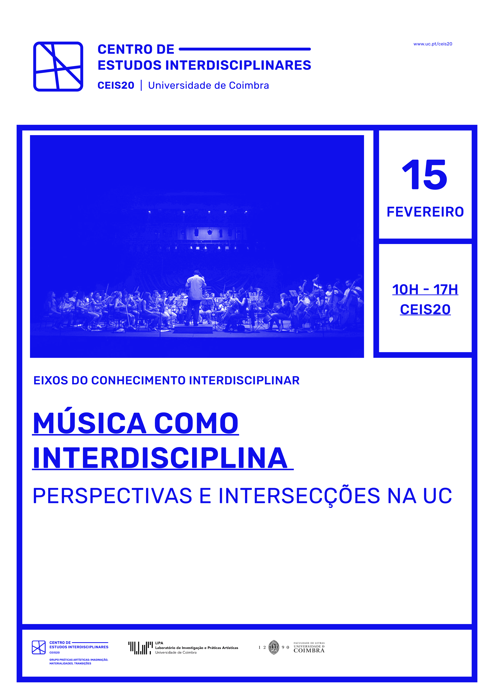

# Música como interdisciplina: Perspectivas e intersecções na Universidade de Coimbra

A Música e domínios adjacentes ocupam um lugar de destaque na investigação que vem sendo desenvolvida no universo da Universidade de Coimbra. As questões colocadas pelo fenómeno musical não só beneficiam de abordagens interdisciplinares, como verdadeiramente convocam um cruzamento de perspectivas, metodologias e campos de conhecimento díspares mas complementares. Neste contexto, torna-se crucial fomentar o contacto entre investigadores, a partilha de projetos e interesses, criando-se oportunidades para colaborações e para o desenvolvimento de uma comunidade académica mais coesa. É com este objetivo que um grupo de investigadores do CEIS20 organiza este evento, assim divulgando o trabalho que vem sendo realizado e promovendo as suas intersecções.

# Programa

## 10:00 -- 11:00
### Cognição e psicologia da música -- Tempo e emoção
Joana Sayal

Pedro Torres Palhares

Alexandre Sayal

Lígia Borges Silva

## 11:00 -- 11:30
### Coffee break

## 11:30 -- 12:30
### Conceptualização, criatividade e tecnologia
Thales Roel Pacobahyba Pessanha

Pedro Augusto

OCH

Nuno Trocado

## 14:00 -- 15:00
### História, paradigmas e identidade
André Granjo

Nils Meisel

Catarina Cota

Inês Mariano

## 15:00 -- 15:30
### Coffee break

## 15:30 -- 17:00
### Mesa Redonda
Pedro Martins

Renato Panda

Óscar Gonçalves

Jônatas Manzolli

José Oliveira Martins

Leonor Losa (moderação)

# Joana Sayal

## Auditory Neuronal Entrainment of Consciousness

A consciência envolve um fluxo de informação neuronal fortemente
associado à sincronização oscilatória no cérebro. O alinhamento entre os
ritmos ambientais e as oscilações cerebrais é conhecido como entrainment
neuronal e poderá desempenhar um papel nos estados de consciência.
Quando ocorre em resposta a estímulos auditivos, é designado entrainment
neural auditivo - as ondas cerebrais estão sincronizadas com as ondas
sonoras. Com base em investigação prévia sobre os efeitos da música em
pacientes com perturbações da consciência, utilizaremos técnicas como
eletroencefalografia e estimulação auditiva (batimentos binaurais) para
caracterizar e modular estados de consciência (atenção focada e
divagação mental) através da estimulação baseada em entrainment
auditivo. Adicionalmente, iremos investigar a influência da formação
musical nesta categoria de entrainment, comparando resultados entre
músicos e não músicos. Compreender o fenómeno de entrainment neuronal
com estimulação auditiva em diversos estados de consciência poderá ser
um contributo para o desenvolvimento das estratégicas de reabilitação em
perturbações da consciência, como o coma, estado vegetativo e o estado
mínimo de consciência.

_Joana Sayal é bolseira de doutoramento em Psicologia (Neurociência
Cognitiva) no Proaction Lab e investiga temas como as neurociências da
consciência, música e neuroplasticidade. Completou em 2022 o Mestrado
Interuniversitário em Neuropsicologia Clínica e Experimental pelas
Universidades de Lisboa, Coimbra e Minho, com estágio curricular na
Neurologia do CHUC e investigação para a tese de mestrado no Proaction
Lab. É formada em violoncelo pelo conservatório de música, tocando em
vários projetos musicais._

# Pedro Torres Palhares

## A neurophenomenological investigation of musical experiencing in jazz improvisation

Musical improvisation is often linked with profound changes in the
quality and intensity of subjective experience, configuring, in many
cases, altered states of consciousness such as absorption, trance or
flow, while also fostering spontaneous thought phenomena like mind
wandering or creative thought. Despite the phenomenological richness and
complexity that characterizes acts of improvisation, no study has
provided a detailed psycho-phenomenological account of improvisatory
experience, how this experience shapes -- and is shaped by -- ongoing
musical performance, or even how sociodemographic variables or musical
training/expertise relate to the musician's experiental profile(s)
during improvisation. Aiming to address these questions, we laid out two
studies, with Study 1 adopting a large-scale psycho-phenomenological
approach, and Study 2 adopting a small-scale neurocognitive approach.
These two ongoing projects will be the focus of my presentation at
"Música na UC", where I will, in a first moment centred on Study 1,
discuss the possibility of studying, from a psycho-phenomenological
standpoint, the structure and configuration of consciousness during acts
of musical improvisation by means of experience sampling
mid-performance. I will then show how this experimental paradigm can be
(and has been) used to assess the impact musical experience on musical
performance itself. Finally, bringing focus to Study 2, I will present a
proposal for studying the brain processes that underlie music cognition,
performance, and creativity from a novel approach, one consisting in the
combination of transcranial magnetic stimulation with
electroencephalography (TMS-EEG).

_I am doing a PhD in Cognitive Neuroscience as a member of the Proaction
Lab, and my work aims to investigate the structure and configuration of
consciousness during musical performance. I privilege the
characterization and explanation of the mechanisms that constitute and
lead to certain states of consciousness, namely mind-wandering and
creative thought. Methodologically, I use psycho-phenomenological
approaches (via experience sampling) and deterministic brain activity
measures (by combining transcranial magnetic stimulation with
electroencephalography \[TMS-EEG\]) during acts of musical
improvisation._

# Alexandre Sayal

### Ouve o teu cérebro: descodificação de emoções evocadas pela música para desenvolvimento de interfaces de neurofeedback com base em fMRI

A música pode transmitir-nos emoções básicas, como a felicidade e
tristeza, e emoções mais complexas, como a ternura ou a tristeza. Os
seus efeitos na regulação emocional têm atraído a atenção da
neurociência cognitiva, no sentido de compreender os mecanismos neurais
subjacentes às emoções evocadas pela música. Aqui apresentamos três
trabalhos em desenvolvimento. O primeiro trabalho foca-se na relação
entre a classificação de trechos musicais de acordo com estados afetivos
e os seus correlatos neurais. Adquirimos dados de IRMf em 20
participantes enquanto ouviam trechos musicais classificados a priori
nos quatro quadrantes do modelo valência-arousal. Caracterizámos os
correlatos neurais em valência (positiva, negativa) e arousal (alto,
baixo) e os resultados destacam sub-regiões específicas da música do
córtex auditivo, tálamo, hipocampo e cerebelo. Depois, criámos um modelo
computacional que descodifica o quadrante correspondente à música com
elevada acurácia, bem acima de um rigoroso nível de acaso. O segundo
trabalho utiliza trechos musicais que os participantes já conhecem e
associam a uma de nove emoções: maravilha, transcendência, ternura,
nostalgia, paz, poder, ativação feliz, tensão, tristeza. A hipótese
centra-se no maior efeito destas músicas e na optimização do protocolo
experimental, com bons resultados preliminares. Por fim, o terceiro
trabalho desenvolve uma interface de neurofeedback baseada em música
para ser utilizada em IRMf. O objetivo é criar uma experiência mais
imersiva e recompensante no processo de conectar o participante e a sua
própria ativação neural durante uma tarefa. Esta abordagem pode
revelar-se importante no desenvolvimento de futuras intervenções em
patologias associadas à regulação emocional.

_Alexandre Sayal concluiu o Mestrado em Engenharia Biomédica em 2016 na Universidade de Coimbra. Investiga na área da neurociência cognitiva,
com particular interesse em ressonância magnética funcional. Após três
anos, inscreve-se no doutoramento em Engenharia Biomédica com o projeto
\"Ouve o teu cérebro: a música como interface para intervenções de
neurofeedback com base em fMRI\", que resulta da combinação da sua
paixão pela música com a vontade de um engenheiro de compreender a
estrutura biológica mais complexa - o cérebro humano._

# Lígia Borges Silva

## Música e percepção temporal - O papel de diversos parâmetros musicais na percepção de passagem do tempo durante a audição de música

A audição de música pode influenciar a percepção temporal do ouvinte.
Desta forma, dois excertos musicais com a mesma duração cronométrica
podem causar a sensação de diferentes durações, ou de uma velocidade
mais rápida ou mais lenta da passagem do tempo. Estudos empíricos
apontam para três tipos de fatores responsáveis por este fenómeno:
musicais, individuais e contextuais. Nesta apresentação será descrito o
trabalho realizado dentro desta temática, no âmbito de um projeto de
tese inserido no curso de Doutoramento em Estudos Artísticos da FLUC.
Começar-se-á por abordar a fase experimental deste projeto, descrevendo
as dificuldades metodológicas reportadas na literatura e as soluções
encontradas e aqui aplicadas. De seguida serão descritos os resultados
obtidos, tendo em conta os fatores musicais abordados (andamento,
métrica, timbre, tonalidade e regularidade rítmica). Serão expostos os
passos futuros previstos no projeto, nomeadamente uma fase dedicada à
análise musical na qual se prevê a aplicação dos conhecimentos obtidos
na fase experimental. Por fim, e relevante para este dia de discussão, a
investigadora partilhará perspectivas futuras de desenvolvimento do
projeto que poderão beneficiar de uma abordagem interdisciplinar,
envolvendo conhecimentos e/ou metodologias provenientes de áreas como as
neurociências, a programação ou a análise musical.

_Lígia Borges Silva é doutoranda no curso de Estudos Artísticos da UC,
onde estuda as relações entre o tempo musical e o tempo subjetivo. O seu
percurso académico é pautado por uma formação estilisticamente variada
dentro da música, que se materializou na conclusão de uma licenciatura
em flauta transversal no âmbito da música clássica, uma licenciatura em
saxofone jazz, e um mestrado em ensino da Música. Participou como
instrumentista em variadas formações musicais, desde ensembles de música
de câmara a orquestras sinfónicas, combos e Jazz Big Bands. Após anos
dedicados à performance musical e ao ensino vocacional de música
atualmente dedica-se exclusivamente à investigação sendo bolseira da
Fundação para a Ciência e a Tecnologia._

# Thales Roel Pacobahyba Pessanha

## Uma plataforma multimodal de interação humano-computador para música e performance interativas

O avanço das tecnologias de mídia digital na criação e execução musical
tem proporcionado novas possibilidades para expressão criativa e
envolvimento do público. A pesquisa em design de mídia computacional
contribuiu para o desenvolvimento de ferramentas sofisticadas,
permitindo a integração de diversas formas de mídia e interação
inovadora com o público. Contudo, a concepção desses sistemas requer uma
compreensão aprofundada dos gestos musicais e sua relação com som,
movimento e significado. Observa-se, nas últimas décadas, uma tendência
crescente na comunidade de interação humano-computador para desenvolver
sistemas capazes de detectar e interpretar uma gama mais ampla de
expressões humanas.

Nesse contexto, o projeto proposto busca aproveitar o potencial do
design de mídia computacional para criar uma experiência de performance
mais integrada e interativa. Isso será alcançado por meio do
desenvolvimento de uma plataforma de interação humano-computador baseada
na web, permitindo a integração de movimento, som, sensores e
instrumentos musicais digitais em todo o ambiente da internet. Além
disso, o projeto visa criar uma experiência sonora mais envolvente e
participativa, oferecendo insights e recomendações para o
desenvolvimento de plataformas eficazes de interação humano-computador.
O processo estruturado e iterativo proposto visa projetar e desenvolver
contextos sonoros que possam ser utilizados em diversas circunstâncias e
por pessoas de diferentes origens culturais.

_Thales Roel é engenheiro de som e pesquisador no Laboratório de Design
Computacional e Visualização. Formou-se em Música com ênfase em
composição pela Universidade Estadual de Campinas (Unicamp), obtendo
também certificação em Engenharia de Som. Atualmente, cursa doutorado em
Design de Médias Computacionais na Universidade de Coimbra, focando em
estratégias de design sonoro que facilitam interações entre humanos e
máquinas. Seu trabalho é orientado pelos Professores Doutores Pedro
Martins e Jônatas Manzolli._

# Pedro Augusto

## Ruído Branco

Ruído e Terapia. O ruído é um aspecto material do som, podendo ser usado
para descrever uma série de situações aurais. Por isso é relacional, é
subjectiva. A quantificação mais possível de ruído é aquela gerada pelo
\"white noise\".

Aqui, iremos demonstrar como a materialidade do ruído e, mais
concretamente, o ruído branco pode conduzir a determinadas ilusões
acústicas, catarses, indução de sono e alheamento do real. Da máquina
sonora de Bernini à transcomunicação, o ruído é transversal a épocas e
culturas, e olhado como forma terapêutica ou de força sobrenatural. Do
som do mar ao \"psithurism\", do regime tecnosonoro desencadeado pela
Revolução Industrial ao tratamento de tinnitus, esta massa sonora em
certa medida, interage fisica e mentalmente com o humano. \"Silence is
not simply de absence of noise.\" (Corbin, 2018)

_Pedro Augusto, desde 2021 é assistente convidado na FBAUP e, desde 2023,
no IPCA. Trabalha como artista e compositor musical para as áreas da
dança, teatro, performance e cinema. Tem largo percurso fonográfico como
produtor, engenheiro de som e editor em diversos álbuns de música
portuguesa da última década. É ainda responsável pelo arquivo Found
Tapes Porto, pelo projecto musical Live Low e pelo selo editorial ETAK.
Nos últimos anos tem dedicado o seu trabalho à curadoria artística e à
edição literária dentro das temáticas da música móvel, serendipidade e
caminhada. Membro do i2ADS._

# OCH
## Community.quantumland.art

Community.quantumland.art é um dos outputs em curso do projecto
IIMPAQCT. No decorrer de um interesse crescente em computação quântica e
práticas criativas, num panorama internacional, surge a necessidade de
poder mapear e conectar esta comunidade emergente. Quais são os eventos,
que trabalhos criativos e escritos estão a ser produzidos, quais
tecnologias estão a ser usadas, quem são os intervenientes, e como se
relacionam todos estes elementos? \"Community.\" surge como uma
plataforma online, desenvolvida em código aberto, para conectar,
documentar, e estimular trabalho criativo e de investigação
interdisciplinar em comunidade. Nesta breve apresentação farei um
walkthrough das duas dimensões da plataforma - forum e database -, e
fazendo também breve referência à filosofia de construção: online
community digital garden.

_OCH is a performer-composer-technologist working on music and quantum
computing, telematics, multimedia, and improvisation. He is passionate
about cinema, teaching, and performing new works. He earned his PhD at
UC Irvine, with research project Adventures in Quantumland
(quantumland.art), and his MA in Music Theory and Composition at ESMAE
with research on the relations between music and painting. In recent
years, his work has been recognized by MSCA, Fulbright, FCT, Medici,
Beall Center for Art+Technology, and IBM.
[omarcostahamido.com](https://omarcostahamido.com)_

# Nuno Trocado
## Analogia na música e metáforas organicistas

A capacidade cognitiva de recurso à analogia é central para um amplo
espectro de habilidades humanas, ubíqua no pensamento quotidiano e
determinante para a experiência mundanal. Na música, a analogia está
fundamentalmente implicada na cognição de padrões sónicos e no
mapeamento de processos gesturais-temporais; e, mais genericamente, nas
múltiplas formas como pensamos, sentimos e nos movemos na e através da
música, individual e colectivamente. Uma das analogias mais disseminadas
na teoria e estética musicais é a do organicismo: a perspectiva de que a
música é animada de uma força vital também presente na natureza,
articulando os componentes de uma obra musical como uma unidade
singular, em crescimento autónomo a partir de uma semente germinal, de
forma análoga aos organismos vivos. A minha investigação abrange três
compreensões organicistas de largo escopo, a saber, as suas motivações
programáticas, estruturais e ecológicas, desde o séc. xix até ao
presente. Nela procuro ainda ressonâncias com a minha prática artística.

_Nuno Trocado (Univ. Coimbra, CEIS20, FLUC) é doutorando em Estudos
Artísticos e bolseiro da FCT. É ainda licenciado em Música / Jazz e
mestre em Composição e Teoria Musical, ambos os graus pela ESMAE. Como
músico, participa em grupos de improvisadores e compõe para diversas
formações instrumentais e electrónica, com especial interesse por
cruzamentos disciplinares. [nunotrocado.com](https://nunotrocado.com/)_

# André Granjo
## António Xavier Monteiro e a música orquestral na Academia de Coimbra em meados do séc. XIX

A prática musical orquestral na Academia de Coimbra é um fenómeno que
pode ser traçado de forma directa desde os finais da primeira metade do
séc. XIX até aos nossos dias, ligando a Orquestra do Teatro Académico, a
Tuna Académica da Universidade de Coimbra e, recentemente, a Orquestra
Académica da UC. Ao longo destes quase 200 anos de história, vários
foram os protagonistas que corporizaram a esta actividade. Pretendemos
focar a nossa atenção na figura do compositor António Xavier de Sousa
Monteiro. Figura totalmente esquecida pela história da música no nosso
país, Monteiro foi aluno da Universidade de Coimbra em meados do séc.
XIX tendo colaborado de forma directa com a Orquestra do Teatro
Académico. A produção musical que hoje lhe conhecemos divide-se entre
obras instrumentais especificamente escritas para a Orquestra do Teatro
Académico, algumas explicitamente ligadas a vivências académicas, e
música de carácter religioso. Xavier Monteiro ficaria sobretudo
conhecido pela sua actividade como Doutor de Direito Canónico e por ter
sido Bispo de Beja. A sua produção musical, ainda que tendo obtido algum
reconhecimento na época, permanece totalmente votada ao esquecimento. Os
esforços da Orquestra Académica da UC em resgatar algumas das suas obras
pretendem dar a conhecer este compositor em particular mas também as
práticas musicais da Academia Coimbrã na segunda metade do séc. XIX,
procurando assim enriquecer o conhecimento da história da música do
nosso país.

_Licenciado em Antropologia pela Universidade de Coimbra, aí frequentou o
Mestrado e o Doutoramento em Ciências Musicais. Mestre em Direcção de
Orquestra de Sopros pela Zuid-Nederlandse Hoogeschool fur Muziek em
Maastricht e, entre 2009 e 2011 foi Visiting Scholar no departamento de
Wind Music Studies da Universidade do Norte do Texas. É membro do
Instituto de Etnomusicologia -- Centro de Estudos de Música e Dança,
maestro titular da Orquestra Académica da UC e Professor Assistente
Convidado do DeCA-UA._

# Nils Meisel
## Pensamento sonoro e a filosofia da ambiência

A apresentação aborda a relação entre a arte sonora e a filosofia,
explorando as implicações conceptuais da arte sonora para além das
formas tradicionais de perceber e compreender o som. Argumenta que o
legado do som na arte ocidental foi definido principalmente através de
estruturas musicais logocêntricas dentro de uma ontologia visual,
limitando a compreensão de qualidades sonoras distintas.\
O surgimento da \"sound art\" nas últimas décadas provoca uma
dissonância nesta narrativa, questionando paradigmas musicais
tradicionais e abrindo espaço crítico importante, através da
experimentação com som, espaço e ambiente. A atenção ao som como meio
artístico revela modos alternativos de pensar e interagir com domínios
espaciais e de tempo fora de regimes dicotómicos e escópicos.\
A diferenciação entre arte sonora e música vai além de classificações de
categorias, abarcando disparidades fundamentais na composição de
ambientes sonoros. A arte sonora activa esta multiplicidade de maneiras
que os conceitos tradicionais de música não alcançam, intervindo no
domínio visual e explorando sensações, afectos, tempo e significados que
transgridem práticas de audição predefinidas e representacionais.\
É importante traçar a linhagem do som na metafísica ocidental para
compreender estas possibilidades, ligada a uma mudança mais ampla dos
modelos logocêntricos de conhecimento fundados na visão, razão e
abstracção. A arte sonora, em particular, e as artes tempo/espaciais, em
geral, remodelam esta narrativa. Novos campos como \"sound studies\" e
\"Sonic Thinking\" testemunham tais transformações, reconfigurando
paradigmas intelectuais.

_Nils Meisel (1981) é artista sonoro e sound designer residente no Porto.
Doutorando em Arte Contemporânea em Coimbra, fez mestrado em Edimburgo e
licenciatura na Universidade Católica. Cofundador das oficinas
\"Collected Sound Fragments\". Trabalha em teatro e cinema experimental.
Cofundador da editora Amateur e do coletivo Apocalypse Hotel. Participa
em projetos musicais como Preto Marfim, Sereias, Lonzdales\'s Fantasy,
10.000 Russos entre outros._

# Catarina Cota
## Os fluxos entre a música popular açoriana e a Canção de Coimbra nos meios de transmissão cultural durante a década de 1960

Partindo da ideia de perspetivas e interceções e servindo-me da
dissertação que estou a desenvolver, pretendo apresentar uma comunicação
sobre Os fluxos entre a música popular açoriana e a Canção de Coimbra,
centrando-se na integração dos estudantes nos planos culturais e na
circulação de canções durante a década de 1960.\
"Como circula uma canção?" é a questão central e geral explorada, na
particularidade dos estudantes deslocados dos Açores no meio académico
coimbrão.\
A metodologia adotada combina abordagens tradicionais da história com
alguns procedimentos da etnomusicologia. Utilizando assim fontes
primárias, como a revista Plateia e fundos disponíveis na BG/UC sobre
vida académica, espólios de repúblicas de Coimbra e entrevistas
exploratórias.\
Esta reflexão tem como base teórica obras como a Enciclopédia de Música
Portuguesa do Século XX, "Notes on deconstructing the popular" de Stuart
Hall e para compreensão do panorama musical português no século XX o
livro de Luís Trindade -- Silêncio Aflito -- A sociedade portuguesa
através da música popular Dos anos 40 aos anos 70 e Machinas Fallantes
-- A música gravada em Portugal no início do Século XX de Leonor Losa. O
contexto histórico é enriquecido por obras como A Canção de Coimbra em
Tempos de Luta Estudantis de Jorge Cravo e "Movimentos estudantis na
crise do Estado Novo: mitos e realidades" de Miguel Cardina.

_Catarina da Rocha Cota, licenciada em História pela Faculdade de Letras
da Universidade de Coimbra e, atualmente, mestranda em História
Contemporânea pela mesma instituição onde está a desenvolver a sua
dissertação com o tema "Os fluxos entre a Música Tradicional Açoriana e
a Canção de Coimbra -- Os anos 60 e o Disco Temas Açorianos (Baladas)\"._

# Inês Mariano
## A negociação identitária através do Dabke e a autenticidade híbrida no Shamstep dos 47Soul

Esta comunicação visa explorar a evolução dinâmica da tradição
folclórica palestina conhecida como Dabke, debruçando-se sobre o seu
papel enquanto palco histórico e contínuo de projeções identitárias ao
serviço de agendas pan-árabes, esforços coloniais israelitas e enquanto
âncora do sentimento nacional palestino. Ao colocar a tónica sobre o
processo que preconizou o encontro entre esta expressão performática e a
música eletrónica, a presente abordagem visa deslindar narrativas
intricadas de projeção identitária, mediação cultural e de
(re)representação. O caso de estudo, personificado pelo grupo 47soul,
ilustra o vasto campo de negociações e renegociações identitárias em
que, necessariamente, assenta a produção cultural de uma segunda e
terceira geração de refugiados palestinos na pessoa destes jovens
nascidos na cosmopolita cidade de Amã, Jordânia.\
Pretende-se avançar uma leitura crítica sobre o modo como o Dabke veio,
historicamente, a mediar, não apenas a causa nacional palestina, mas
também agendas pan-árabes reminiscentes de uma "Grande Síria" (Sham), ou
ainda sendo co-adoptado ao serviço da legitimação do projecto colonial
israelita. Esta proposta enfatiza a evolução contemporânea da expressão
sónica do dabke no sentido da música eletrónica, focando-se no conceito
de "Terceiro Espaço" avançado por Homi K. Bhabha. Neste terceiro espaço,
o Dabke eletrónico, sob títulos como Shamstep e outros, transforma-se em
verdadeiro palco de negociações identitárias múltiplas, envigorado pelas
experiências de uma nova geração de músicos que se vê a braços com a
problemática multifacetada de coexistir enquanto palestinianos
desenraizados num país que os acolhe e, simultaneamente, apelar a uma
audiência internacional.

_Sou licenciada em História da Arte pela Universidade de Coimbra e
mestranda no Mestrado de Estudos Artísticos oferecido pela mesma
instituição. Em 2020 fui bolseira de iniciação à investigação pela FCT,
integrando o projecto "Tectos Pintados em Portugal: sécs. XIV-XVI" sob
mentoria das Dr.as Joana Antunes e Marta Simões, do qual foi fruto a
comunicação do mesmo nome inserida no colóquio Patrimónios (In)Visíveis
no qual fui oradora._

# Comissão organizadora

Lígia Borges Silva

Nuno Trocado

José Oliveira Martins
